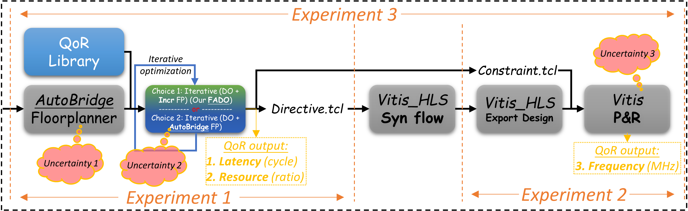

# FADO
Floorplan-Aware Directive Optimization for HLS designs on Multi-die FPGAs

---
---

## Important Notice (***Under Artifact Evaluation!***)

Thanks for using our FADO framework! FADO is developed by the **[Reconfiguration Computing System Lab @ HKUST](https://eeweiz.home.ece.ust.hk/)**, and to appear as a regular paper (oral) in the International Symposium [FPGA 2023](https://www.isfpga.org/).

---
---

## Environment Requirements

* Step 0: System Checking (only verified versions are listed, other versions are not guaranteed)
    * Ubuntu OS: 20.04.4 LTS / 20.04.5 LTS
    * Linux: 5.4.0-050400-generic / 5.14.0-1054-oem
    * Vitis/Vitis_HLS/Vivado **2020.2**
    * $\geq$ 64GB DDR4 for back-end implementation using Vitis, as suggested by Xilinx document [UG1301](https://docs.xilinx.com/r/en-US/ug1301-getting-started-guide-alveo-accelerator-cards/Minimum-System-Requirements)
* Step 1: Apt: a single command: **`bash step1-install-apt-packages.sh`**, or separate commands: `sudo apt install <the following packages>`
    * faketime
    * iverilog
    * swig *pre-requisite for `pip install oapackage`*
* Step 2: Python 3.9: a single command: **`pip install -r step2-pip-requirements.txt`**, or separate commands: `pip install <the following packages>`
    * OApackage==2.7.1   *for ploting pareto front*
    * matplotlib==3.5.1
    * defaultlist==1.0.0
    * graphviz==0.20
    * anytree==2.8.0
    * pyverilog==1.3.0
    * mip==1.14.0
* Step 3: Packages for Alveo U250 Board (*Please notice that (2) and (3) in our environment are too old and abandoned on the current Xilinx website. Hence, please use our archive to have the same experiment environment.*)
    * (1) Download ([https://www.xilinx.com/products/boards-and-kits/alveo/u250.html#gettingStarted](https://www.xilinx.com/products/boards-and-kits/alveo/u250.html#gettingStarted)) and install the Xilinx Runtime using 
        * `sudo apt install ./xrt*.deb`
    * (2) Download ([deployment_archive](https://hkustconnect-my.sharepoint.com/:u:/g/personal/lduac_connect_ust_hk/EdL-DJp31WdPrzwD93HSb6EBWUEWWSQBKfarKUxRUXqMxw?e=XjiWym)) and install the U250 **Deployment** Platform using
        * `sudo apt-get install ./xilinx-u250-xdma-201830.2-2580015_18.04.deb`
    * (3) Download ([development_archive](https://hkustconnect-my.sharepoint.com/:u:/g/personal/lduac_connect_ust_hk/EamayEel6blCvIA6SIe4DU0BDoZmIatOJLkdJOezWXxvrQ?e=B9vbTo)) and install the U250 **Development** Platform using
        * `sudo apt-get install ./xilinx-u250-xdma-201830.2-dev-2580015_18.04.deb`

---
---

## Artifact Evaluation

For **artifact evaluation**, if you come across any difficulty about the environment or experiments, or if you need us to provide a remote environment for you, please do not hesitate to contact ***Linfeng Du*** @ *<linfeng.du@connect.ust.hk>*. We will get back to you ASAP (most likely within 24 hours).

To reproduce the results shown in the FADO paper, to be specific, mainly the ***last two rows*** of **Table 5** and the whole **Table 6**, we design the following three experiments. Plesae find below the:
1. working directory and the corresponding data entry in **Table 5** and/or **Table 6**
2. command used in terminal
3. the explanation about generated results and output log
4. the uncertainty analysis: <span style="color:blue">whether you can reproduce the same or very close results as shown in the paper</span> -- same results will be reproduced for some experiments, while others could vary because of the uncertainty shown in the workflow figure below.
    * <span style="color:pink">*Uncertainty 1*</span>: the initial "AutoBridge Floorplanner" using MILP solver could give various initial solutions
    * <span style="color:pink">*Uncertainty 2*</span>: iterative calling "AutoBridge Floorplanner" could lead to more uncertainty in the resulting QoR output
    * <span style="color:pink">*Uncertainty 3*</span>: randomness during back-end placement and routing (P&R)
    * About runtime:
        * CPU performance difference
        * Operating system process scheduling
        * random convergence time of MILP solver
            * Notice: although we can set [random seeds](https://python-mip.readthedocs.io/en/latest/classes.html#:~:text=property-,seed,-Random%20seed.%20Small) to keep the solver's performance stable, it could limit the optimality of results generated. Instead, we run experiments multiple times and reported the most common observation of latency and resource in our paper.
        * ...



---

### Experiment 1: Latency, Resource and DSE Runtime

* Command:
    ```bash
    python main.py 2 9
    ```    
    * "2" for AutoBridge Floorplanner
    * "9" for various choices of directive optimization (and iterative floorplan legalization)

* Working directories: 
    * `./benchmarks/.*/latency_fp_do`:
        * Corresponding data entry in the paper
            * Table 5: "Initial FP -> Iterative DO" (the second line)
        * Uncertainty analysis: (factor: <span style="color:pink">*Uncertainty 1*</span>)
            * latency: <span style="color:green">almost always the same</span>
            * resource: <span style="color:green">almost always the same</span>
            * runtime: <span style="color:orange">could vary</span>
    * `./benchmarks/.*/latency_ab`:
        * Corresponding data entry in the paper
            * Table 5: "Iterative (DO + AutoBridge FP)" (the third line)
        * Uncertainty analysis: (factors: <span style="color:pink">*Uncertainty 1, Uncertainty 2*</span>)
            * latency: <span style="color:green">almost always the same</span>
            * resource: <span style="color:green">almost always the same</span>
            * runtime: <span style="color:darkorange">could vary</span>, especially because of **MILP solver's convergence randomness**
    * `./benchmarks/.*/latency_fado`: 
        * Corresponding data entry in the paper
            * Table 5: "Original (no directive)" (the first line)
            * Table 5: <span style="color:blue">"Iterative (DO + Incr FP) (**Ours**)" (the fourth line)</span>
            * Table 6 (the whole table)
        * Uncertainty analysis: (factor: <span style="color:pink">*Uncertainty 1*</span>)
            * latency: <span style="color:green">almost always the same</span>
            * resource: <span style="color:green">almost always the same</span>
            * runtime: <span style="color:orange">could vary</span>
            * specially, the "mttkrp_cov" benchmark could have larger randomness because the final utilization is very close to the upper limit of available resource on the FPGA. Except for the most common results reported in our paper, other common results include:
                > ======== DSE Stages (Table 6) MTTKRP\*2+COV\*2 ========  
                > Stage 0: Online  
                > &nbsp;  Resource: 57.10%, Latency (thousand cycles): 160062.3  
                > Stage 1: Online+Offline  
                > &nbsp;  Resource: 57.10%, Latency (thousand cycles): 160062.3  
                > Stage 2: Online+Offline+Ahead  
                > &nbsp;  Resource: 63.45%, Latency (thousand cycles): 101763.6  
                > Stage 3: Online+Offline+Ahead+Back  
                > &nbsp;  Resource: 64.39%, Latency (thousand cycles): 101755.4  
                or
                > 
                > ======== DSE Stages (Table 6) MTTKRP\*2+COV\*2 ========  
                > Stage 0: Online  
                > &nbsp;  Resource: 63.15%, Latency (thousand cycles): 163241.1  
                > Stage 1: Online+Offline  
                > &nbsp;  Resource: 64.67%, Latency (thousand cycles): 153927.2  
                > Stage 2: Online+Offline+Ahead  
                > &nbsp;  Resource: 63.26%, Latency (thousand cycles): 129184.0  
                > Stage 3: Online+Offline+Ahead+Back  
                > &nbsp;  Resource: 63.25%, Latency (thousand cycles): 128104.0  

* Output log:
    * in `./benchmarks/.*/output/latency_resource_runtime.log`
    * Example log of test `./benchmark/cnn_2mm/latency_fado`:
        > Iterative (DO + Incr FP) (Our FADO) directive search result (Table 5):  
        > Runtime (s): 1.7685  
        > Latency (thousand cycles): 91.164  
        > Resource: 55%   
        > ============ DSE Stages (Table 6) ============  
        > Original (no directive):  
        > &nbsp;  Resource: 28.27%, Latency (thousand cycles): 8933.0  
        > Stage 0: Online  
        > &nbsp;  Resource: 28.27%, Latency (thousand cycles): 734.6  
        > Stage 1: Online+Offline  
        > &nbsp;  Resource: 40.12%, Latency (thousand cycles): 131.8  
        > Stage 2: Online+Offline+Ahead  
        > &nbsp;  Resource: 55.01%, Latency (thousand cycles): 91.4  
        > Stage 3: Online+Offline+Ahead+Back  
        > &nbsp;  Resource: 54.56%, Latency (thousand cycles): 91.2  

* Explanation:
    * Experiment 1 is designed for you to get almost the same latency and resource, and proportional runtime for every test case, as reported in our paper.

---

### Experiment 2: Frequency Test Only

* Command:
    ```bash
    python main.py 3 4
    ```    
    * "3" for exporting RTL design, and packing XO
    * "4" for running Vitis flow (v++)

* Working directories: 
    * `./benchmarks/.*/freq_fp_do`:
        * Corresponding data entry in the paper
            * Table 5: "Initial FP -> Iterative DO" (the second line)
        * Uncertainty analysis: (factor: <span style="color:pink">*Uncertainty 3*</span>)
            * frequency: <span style="color:green">almost always the same</span>
    * `./benchmarks/.*/freq_ab`:
        * Corresponding data entry in the paper
            * Table 5: "Iterative (DO + AutoBridge FP)" (the third line)
        * Uncertainty analysis: (factors: <span style="color:pink">*Uncertainty 3*</span>)
            * frequency: <span style="color:green">almost always the same</span>
    * `./benchmarks/.*/freq_fado`: 
        * Corresponding data entry in the paper
            * Table 5: <span style="color:blue">"Iterative (DO + Incr FP) (**Ours**)" (the fourth line)</span>
        * Uncertainty analysis: (factor: <span style="color:pink">*Uncertainty 3*</span>)
            * frequency: <span style="color:green">almost always the same</span>

* Output:
    * Please check the post-implementation Fmax using the script [`./script/get_freq.py`](./script/get_freq.py), e.g., starting from the currect base directory:
        ```bash
        cd ./benchmarks/cnn_2mm/freq_fado/
        python ../../../script/get_freq.py .
        ```
    * Example output in the terminal:
        > Usage: `python get_freq.py $(realpath [benchmark base])`
        > Relative path: ./vitis_run/top_xilinx_u250_xdma_201830_2.temp/reports
        > Full vitis report path: ./vitis_run/top_xilinx_u250_xdma_201830_2.temp/reports/link/imp
        > Timing report found: ./vitis_run/top_xilinx_u250_xdma_201830_2.temp/reports/link/imp/> impl_1_xilinx_u250_xdma_201830_2_bb_locked_timing_summary_postroute_physopted.rpt  
        >   
        > Fmax: 274.10

* Explanation:
    * Experiment 2 is designed for you to get almost the same frequency for every test case as reported in paper.

---

### Experiment 3: Whole Flow of FADO

* Command:
    ```bash
    python main.py 2 9
    python main.py 3 4
    ```

* Working directories:
    * `./benchmarks/.*/all_ab`:
        * Corresponding data entry in the paper
            * Table 5: "Iterative (DO + AutoBridge FP)" (the third line)
    * `./benchmarks/.*/freq_fado`: 
        * Corresponding data entry in the paper
            * Table 5: <span style="color:blue">"Iterative (DO + Incr FP) (**Ours**)" (the fourth line)</span>

* Output:
    * Latency, Resource, and Runtime in `./benchmarks/.*/output/latency_resource_runtime.log`.
    * Fmax using the script [`./script/get_freq.py`](./script/get_freq.py).

* Explanation:
    * Experiment 3 is designed for you to test the functionality of FADO' whole workflow. 
    * Since all uncertainties mentioned are included in this test, the QoR output <span style="color:orange">could vary</span> a little bit more than previous experiments.

---
---
<!-- 
## Contents in The Previous Anonymous Repo

* Archive of Pre-generated log under `./benchmarks/*/pre-generated-logs`, used during blind review.

    * _dut.cpp_: source code (containing dataflow/non-dataflow kernels)

    * _top_: the __directory__ of initial HLS synthesis reports and RTL code, named after the top function __top__ in _dut.cpp_

    * _fado.log_ or _fado\_log.zip_: log during running FADO over *top* directory

    * _directives.tcl_: results of directive search

    * _constraint.tcl_: results of floorplan search

    * _imp_: the __directory__ Vitis log after implementation on the Alveo U250 multi-die FPGA
 -->
